# 遊戲步驟流程
## A. 遊戲準備階段
1. 等待加入遊戲人數
2. 滿4人自動進入牌桌

## B. 開局自動流程
1. 開始遊戲
2. 幫玩家隨機抽風位(東、南、西、北)
3. 通知玩家自已的風位
4. 通知莊家擲骰子
5. 根據骰子點數切牌牆
6. 玩家抓牌並完成補花
7. 通知玩家開局手牌

## C. 牌局循環
0. 風位進行動作(東/南/西/北)
1. 通知玩家摸牌
* 玩家決定動作 (5秒後UI自動摸牌)
    * 1:摸牌/自動摸牌
* 摸牌->確認花牌->補花
* 檢查手牌狀態(滿17張) 胡牌/槓牌/出牌
* 通知玩家摸(補)到的牌可進行的動作
* 玩家決定動作 (10秒後UI自動打出摸進的牌)
    * 1:胡牌 2:槓牌 3:出牌
2. 玩家出牌後，確認閒家(三人)手牌
* 是否可 胡牌/槓牌/碰牌/吃牌
* 決定閒家(下家/對家/上家)優先權
    * 1.下家 1:胡牌/2:槓牌/3:碰牌/吃牌/摸牌
    * 2.對家 1:胡牌/2:槓牌/3:碰牌/PASS
    * 3.上家 1:胡牌/2:槓牌/3:碰牌/PASS
* 通知高優先權閒家進行動作
* 閒家決定動作
    * 下家 胡牌/槓牌/碰牌/吃牌/摸牌
    * 對家 胡牌/槓牌/碰牌/PASS
    * 上家 胡牌/槓牌/碰牌/PASS
3. 死牆區16張已空
* 玩家補花或補牌時，因死牆區無牌可補，立即流局結算

## D. 動作流程
1. 胡牌流程
* 將手牌顯示給全部玩家看(17張)
* 計算胡牌台數
* 結算金額
* 通知玩家結果
* 若是莊家胡牌則連莊次數+1，否則連莊次數歸零
* 若非莊家胡牌則換下一局風位當莊家
* 重新洗牌
* 回到 B. 開局自動流程

2. 槓牌流程
* 選取要槓的牌張(3張)進行槓牌
* 暗槓則蓋牌(放進暗槓搭組)
* 明槓則翻牌(放進槓搭組) -> 確認其它玩家是否槍槓胡
* 回到 C. 牌局循環 -> 摸牌(自動補牌)

3. 碰牌流程
* 選取要碰的牌張(2張)進行碰牌
* 將玩家碰的牌翻牌(放進碰搭組)
* 跳到 6. 出牌流程

4. 吃牌流程
* 選取要吃的牌張(2張)進行吃牌
* 將玩家吃的牌翻牌(放進吃搭組)
* 跳到 6. 出牌流程

5. 摸牌流程
* 回到 C. 牌局循環 -> 摸牌

6. 出牌流程
* 選取要出的牌張(1張)進行出牌
* 放進棄牌區
* 回到 C. 牌局循環 -> 2. 玩家出牌後，確認閒家(三人)手牌

7. PASS流程
* 標記高優先權閒家為 PASS
* 若可胡牌，需標記過水並限制在本回合內不能再胡任何其他牌，直到玩家解除過水狀態。
* 回到 C. 牌局循環 -> 通知高優先權閒家進行動作

## E. 流局結算
* 確認4位玩家是否有/無聽牌(16張)
* 將4位玩家手牌顯示出來並標示有/無聽牌(16張)
* 此局為臭莊，連莊次數+1
* 重新洗牌
* 回到 B. 開局自動流程

## F. 雀局結束
* 當完成四個風圈即一雀結束
* 通知玩家是否繼續下一雀
* 若4人都按同意則繼續下一雀，否則結束遊戲

## Mermaid Flowcharts (graph TD)
1. Online Mermaid Diagrams Editor, https://mermaid-drawing.com/

### A. [遊戲準備與開局自動流程](flowchart/遊戲準備與開局自動流程.svg)
```Mermaid
graph TD
    A[遊戲開始/重新開始] --> A1{等待加入遊戲人數};
    A1 --> |未滿4人| A1;
    A1 --> |滿4人| B1[幫玩家隨機抽風位/定莊家];
    B1 --> B2[通知玩家風位];
    B2 --> B3[通知莊家擲骰子/切牌牆];
    B3 --> B4[發牌給所有玩家];
    B4 --> B5{莊家/閒家有花牌?};
    B5 --> |有花牌| B6[依序完成補花 <嶺上補牌>];
    B6 --> B7[檢查死牆區是否已空?];
    B7 -- 是 --> E[流局結算];
    B7 -- 否 --> B8[通知玩家開局手牌 <滿17張/16張>];
    B8 --> C0[牌局循環開始];
```

### B. [牌局循環](flowchart/牌局循環.svg) (C. 牌局循環)
```Mermaid
graph TD
    C0 --> C1[輪到當前風位 <莊家/閒家> 進行動作];
    C1 --> C2[通知玩家摸牌/倒數5秒];
    C2 --> C3{玩家在5秒內決定動作?};
    
    C3 -- 摸牌/PASS/超時 --> C4[執行摸牌流程];
    
    C4 --> C5{摸到花牌?};
    C5 -- 是 --> C6[補花流程];
    C6 --> C7[檢查死牆區已空?];
    C7 -- 是 --> E[流局結算];
    C7 -- 否 --> C4;  補完花牌後繼續摸牌
    C5 -- 否 --> C8[通知玩家摸到的牌/倒數10秒];

    C8 --> C9{玩家在10秒內決定動作?};
    C9 -- 胡牌 --> D1[胡牌流程];
    C9 -- 槓牌 --> D2[槓牌流程];
    C9 -- 出牌/PASS/超時 --> D3[出牌流程];

    D3 --> C10[玩家出牌後，閒家動作宣告階段];
    C10 --> C11[檢查閒家是否可 胡/槓/碰/吃?];
    C11 --> C12[決定閒家優先權];
    
    C12 --> C13{是否有高優先權閒家?};
    C13 -- 是 --> C14[通知高優先權閒家動作/倒數10秒];
    
    C14 --> C15{閒家決定動作?};
    C15 -- 胡/槓/碰/吃 --> D4[執行動作流程 <胡/槓/碰/吃>];
    D4 --> C0[動作成功，回到 C0];
    
    C15 -- PASS --> D5[PASS流程];
    D5 --> C13[檢查下一順位閒家];
    
    C13 -- 否 <無人宣告> --> C0[回到 C0 進行下一輪摸牌];
```

### C. 動作執行與結算流程 (D. 動作流程)  
#### C1. [胡牌流程](flowchart/胡牌流程.svg) (D1)
```Mermaid
graph TD
    D1[胡牌流程] --> D1a[顯示手牌/計算台數/結算金額];
    D1a --> D1b{莊家胡牌?};
    D1b -- 是 --> D1c[連莊次數+1];
    D1b -- 否 --> D1d[連莊次數歸零/換下一局風位當莊];
    D1c --> D1e[重新洗牌];
    D1d --> D1e;
    D1e --> B1[回到 B. 開局自動流程];
```

#### C2. [槓牌流程](flowchart/槓牌流程.svg) (D2)
```Mermaid
graph TD
    D2[槓牌流程] --> D2a[選取槓牌/暗槓/明槓];
    D2a --> D2b{明槓?};
    D2b -- 是 --> D2c[檢查槍槓胡];
    D2c -- 否 --> D2d[槓牌搭組處理 <翻牌/蓋牌>];
    D2d --> D2e[檢查死牆區已空?];
    D2e -- 是 --> E[流局結算];
    D2e -- 否 --> D2f[回到 C. 牌局循環/摸牌 <自動補牌>];
```

#### C3. [碰/吃流程](flowchart/碰吃流程.svg) (D4)
```Mermaid
graph TD
    D4[碰/吃流程] --> D4a[選取牌張/搭組處理];
    D4a --> D4b[跳到 出牌流程 D3];
```

#### C4. [PASS流程](flowchart/PASS流程.svg) (D5)
```Mermaid
graph TD
    D5[PASS流程] --> D5a{是否可胡牌但PASS?};
    D5a -- 是 --> D5b[標記過水/限制本回合胡牌];
    D5b --> C13[回到 C13 檢查下一優先權閒家];
    D5a -- 否 --> C13;
```

### D. [終局與流局](flowchart/終局與流局.svg) (E. 流局結算 & F. 雀局結束)
```Mermaid
graph TD
    E[流局結算] --> E1[確認4位玩家聽牌狀態/顯示手牌];
    E1 --> E2[結算流局金 <臭莊>/連莊次數+1];
    E2 --> E3[重新洗牌];
    E3 --> B1[回到 B. 開局自動流程];
    
    F1[遊戲結束] --> F2{完成四個風圈 <16局>?};
    F2 -- 是 --> F3[詢問玩家是否繼續下一雀];
    F3 --> F4{全部同意?};
    F4 -- 是 --> B1[回到 B. 開局自動流程 <但需換風圈>];
    F4 -- 否 --> F5[結束遊戲];
```


### 狀態機圖
```Mermaid
stateDiagram-v2
    direction LR

    [*] --> S_SETUP: 啟動遊戲

    state S_SETUP {
        direction LR
        S_INIT: 準備_等待玩家(A.1)
        S_DEAL: 開局_發牌補花(B.1-B.7)
        
        S_INIT --> S_DEAL: 滿4人進入(A.2)
        S_DEAL --> S_TURN_CYCLE: 發牌完成
        S_DEAL --> S_END_DRAW: 補花時死牆區空
    }

    state S_TURN_CYCLE {
        direction LR
        S_MOPAI: 循環_摸牌階段(C.1)
        S_OUTCOME: 循環_摸牌後決策
        S_DISCARD: 動作_出牌階段(D.6)
        
        S_MOPAI --> S_OUTCOME: 摸牌/補花完成(C.1)
        
        S_OUTCOME --> S_HUPAI: 玩家自摸(D.1)
        S_OUTCOME --> S_GANG: 玩家暗槓/加槓(D.2)
        S_OUTCOME --> S_DISCARD: 玩家出牌(C.1.3)
        S_OUTCOME --> S_END_DRAW: 摸牌/補花時死牆區空(C.3)

        S_DISCARD --> S_CLAIM_RESOLUTION: 出牌完成(D.6)
        
        S_CLAIM_RESOLUTION --> S_MOPAI: 無人動作/PASS (下一位摸牌)
        S_CLAIM_RESOLUTION --> S_TURN_CYCLE_ENTRY: 碰/吃動作成立(D.3/D.4)
        S_CLAIM_RESOLUTION --> S_HUPAI: 放槍胡牌(D.1)

        S_TURN_CYCLE_ENTRY: 回合轉接點
        S_TURN_CYCLE_ENTRY --> S_DISCARD: 進入出牌階段(D.3/D.4後)
        
        [*] --> S_MOPAI: 初始進入 (從 SETUP/NEW_ROUND)
    }

    state S_CLAIM_RESOLUTION {
        direction LR
        S_PRIORITY_CHECK: 檢查優先權(C.2)
        S_DECISION: 閒家動作決定/PASS(D.7)
        S_PRIORITY_CHECK --> S_DECISION: 通知閒家決策
    }

    state S_HUPAI {
        S_HUPAI_CALC: 胡牌計算/結算(D.1)
    }

    state S_GANG {
        S_GANG_CHECK: 槓牌處理/槍槓胡檢查(D.2)
        S_GANG_CHECK --> S_MOPAI: 槓後摸牌(D.2.3)
    }
    
    S_SETUP --> S_TURN_CYCLE: 牌局準備完成
    S_TURN_CYCLE --> S_END_SESSION: 完成四個風圈(F)
    
    S_HUPAI --> S_NEW_ROUND: 胡牌結算完成
    S_END_DRAW: 流局結算(E)
    S_END_DRAW --> S_NEW_ROUND: 流局結算完成

    S_NEW_ROUND: 新局準備(D.1.6/E.3)
    S_NEW_ROUND --> S_SETUP: 進入下一局初始化(B.1)

    S_END_SESSION: 雀局結束(F)
    S_END_SESSION --> S_NEW_ROUND: 同意續雀
    S_END_SESSION --> [*]: 結束遊戲
```


### 狀態機圖說明與關鍵轉換
#### 1. 遊戲初始化 (S_SETUP)
* S_INIT -> S_DEAL： 玩家滿 4 人時觸發。  
* S_DEAL -> S_TURN_CYCLE： 發牌、補花等初始化流程全部完成後，進入回合循環。  
* S_DEAL -> S_END_DRAW： 補花時，發現牌牆無牌可補，直接轉移至流局結算。  
#### 2. 核心回合 (S_TURN_CYCLE)
* 摸牌後決策 (S_OUTCOME)：
  * -> S_HUPAI (胡牌)： 玩家選擇自摸。
  * -> S_GANG (槓牌)： 玩家選擇暗槓或加槓，槓後流程會強制回到 S_MOPAI 進行補牌。
  * -> S_DISCARD (出牌)： 這是最常見的轉換，進入出牌階段。
* 動作宣告 (S_CLAIM_RESOLUTION)：
  * -> S_HUPAI： 閒家對棄牌宣告胡牌 (放槍)。
  * -> S_TURN_CYCLE_ENTRY (碰/吃成功)： 宣告成功後，回合轉移給該玩家，進入 S_DISCARD 出牌。
  * -> S_MOPAI (無動作)： 無人宣告或宣告者皆 PASS，回合轉移給下一家，進入 S_MOPAI 摸牌。
#### 3. 局間結算與準備
* S_HUPAI (胡牌結算) -> S_NEW_ROUND： 結算台數和金額後，進入新局準備。
* S_END_DRAW (流局結算) -> S_NEW_ROUND： 流局結算後，進入新局準備。
* S_NEW_ROUND -> S_SETUP： 處理完連莊/換莊和洗牌邏輯後，重新進入初始化 (S_DEAL) 流程，開始新的一局。
#### 4. 終局
* S_TURN_CYCLE -> S_END_SESSION： 完成四個風圈 (16 局) 時觸發。
* S_END_SESSION -> [*]： 玩家選擇結束遊戲。

### I. 頂層狀態與終止點
| 狀態名稱 | 類型 | 程式碼對應 | 說明與職責 |
|:--|:--|:--|:--|
| [*] | 偽狀態 | N/A | 起始點 和 最終終止點。 |
| S_SETUP | 複合 | MahjongGame.initialize_round() | 遊戲初始化階段。 負責處理牌局開始前的所有準備工作，從等待玩家到完成發牌和補花。 |
| S_TURN_CYCLE | 複合 | MahjongGame.run_turn() | 遊戲核心循環。 處理從一位玩家摸牌到另一位玩家摸牌之間的複雜流程，包含摸牌、出牌、槓牌、宣告處理等。 |
| S_NEW_ROUND | 單一 | MahjongGame.prepare_next_round() | 局間準備狀態。 處理胡牌或流局後的結算後續工作，如莊家連莊/換莊、分數更新，然後準備進入下一局。 |
| S_END_SESSION | 單一 | MahjongGame.end_session() | 雀局結束狀態。 判斷是否打滿四圈，並詢問玩家是否繼續下一雀。 |
### II. 複合狀態詳解
A. S_SETUP (遊戲準備階段)
| 內部狀態 | 進入條件 (轉換) | 離開條件 (轉換) | 程式碼事件 |
|:--|:--|:--|:--|
| S_INIT | 從 [*] 或 S_NEW_ROUND 進入 | → S_DEAL (滿 4 人) | 偵測到 4 位玩家連線成功。 |
| S_DEAL | 從 S_INIT 進入 | → S_TURN_CYCLE (牌局準備完成) | 完成發牌、抽風位、莊家擲骰、所有玩家補花。 |
| S_DEAL | - | → S_END_DRAW (補花時牌牆已空) | 在補花流程中，牌牆的牌數少於所需。 |

B. S_TURN_CYCLE (回合核心循環)
| 內部狀態 | 進入條件 (轉換) | 離開條件 (轉換) | 程式碼事件 |
|:--|:--|:--|:--|
| S_MOPAI | 從 S_SETUP / S_CLAIM_RESOLUTION / S_GANG 進入 | → | S_OUTCOME (摸牌完成/補花完成) | 玩家從牌牆摸到一張牌並完成所有補花。 |
| S_OUTCOME | 從 S_MOPAI 進入 | → S_HUPAI (自摸胡牌) | | check_for_win 確認可胡牌，玩家選擇胡牌。 |
| S_OUTCOME | - | → S_GANG (槓牌) | check_available_claims 有暗槓/| 加槓，玩家選擇執行。 |
| S_OUTCOME | - | → S_DISCARD (必須出牌) | 未胡牌/未槓牌，玩家必須打牌。 |
| S_DISCARD | 從 S_OUTCOME / S_TURN_CYCLE_ENTRY 進入 | → | S_CLAIM_RESOLUTION (出牌完成) | 玩家點擊手牌，發送 /action/discard API 請求。 |
| S_TURN_CYCLE_ENTRY | 從 S_CLAIM_RESOLUTION 進入 (碰/吃成功) | → | S_DISCARD | 碰/吃成功後，直接將回合交給該玩家出牌。 |

C. S_CLAIM_RESOLUTION (動作宣告優先級)
| 內部狀態 | 進入條件 (轉換) | 離開條件 (轉換) | 程式碼事件 |
|:--|:--|:--|:--|
| S_PRIORITY_CHECK | 從 S_DISCARD 進入 | → S_DECISION (通知閒家決策) | 後端 resolve_claims 函式完成優先級排序。 |
| S_DECISION | 從 S_PRIORITY_CHECK 進入 | → S_HUPAI (胡牌成立) | 閒家選擇胡牌 (放槍)。 |
| S_DECISION | - | → S_TURN_CYCLE_ENTRY (碰/吃成立) | 閒家選擇碰/吃，進入出牌流程。 |
| S_DECISION | - | → S_MOPAI (無人動作/PASS) | 所有閒家皆 PASS 或無有效宣告，回合轉移到下一家摸牌。 |

### III. 獨立動作與結算狀態
| 狀態名稱 | 職責與轉換 | 程式碼事件 |
|:--|:--|:--|
| S_GANG | 處理槓牌。 檢查槍槓胡、搭子移動、然後立即轉回 → S_MOPAI，觸發槓上補牌。 | 玩家選擇槓牌，執行 execute_gang()。 |
| S_HUPAI | 處理胡牌結算。 計算台數、金額結算、連莊/換莊邏輯。 | 從 S_OUTCOME (自摸) 或 S_CLAIM_RESOLUTION (放槍) 進入。 |
| S_END_DRAW | 處理流局結算。 判斷聽牌狀態、執行不聽牌包賠罰金結算。 | 從 S_DEAL 或 S_OUTCOME (牌牆已空) 進入。 |
| S_NEW_ROUND | 新局準備。 執行連莊/換莊邏輯、清除牌桌狀態、洗牌。 | 從 S_HUPAI 或 S_END_DRAW 進入，結束後 → S_SETUP 重新開始。 |

### 轉換邏輯總結
| 觸發事件 | 轉換 (From → To) | 目的地 | 下一步操作 |
|:--|:--|:--|:--|
| 胡牌 (自摸/放槍) | S_OUTCOME/S_DECISION → S_HUPAI | S_HUPAI | 執行結算。 |
| 回合結束 (無宣告) | S_CLAIM_RESOLUTION → S_MOPAI | S_MOPAI | 回合轉移給下一家，並摸牌。 |
| 碰/吃成功 | S_CLAIM_RESOLUTION → S_TURN_CYCLE_ENTRY | S_DISCARD | 回合轉移給該玩家，直接出牌。 |
| 一局結束 (胡牌/流局) | S_HUPAI/S_END_DRAW → S_NEW_ROUND | S_SETUP | 準備好新莊家後，重新開始初始化流程。 |
