# 遊戲步驟流程
## A. 遊戲準備階段
1. 等待加入遊戲人數
2. 滿4人自動進入牌桌

## B. 開局自動流程
1. 開始遊戲
2. 幫玩家隨機抽風位(東、南、西、北)
3. 通知玩家自已的風位
4. 通知莊家擲骰子
5. 根據骰子點數切牌牆
6. 玩家抓牌並完成補花
7. 通知玩家開局手牌

## C. 牌局循環
0. 風位進行動作(東/南/西/北)
1. 通知玩家摸牌
* 玩家決定動作 (5秒後UI自動摸牌)
    * 1:摸牌/自動摸牌
* 摸牌->確認花牌->補花
* 檢查手牌狀態(滿17張) 胡牌/槓牌/出牌
* 通知玩家摸(補)到的牌可進行的動作
* 玩家決定動作 (10秒後UI自動打出摸進的牌)
    * 1:胡牌 2:槓牌 3:出牌
2. 玩家出牌後，確認閒家(三人)手牌
* 是否可 胡牌/槓牌/碰牌/吃牌
* 決定閒家(下家/對家/上家)優先權
    * 1.下家 1:胡牌/2:槓牌/3:碰牌/吃牌/摸牌
    * 2.對家 1:胡牌/2:槓牌/3:碰牌/PASS
    * 3.上家 1:胡牌/2:槓牌/3:碰牌/PASS
* 通知高優先權閒家進行動作
* 閒家決定動作
    * 下家 胡牌/槓牌/碰牌/吃牌/摸牌
    * 對家 胡牌/槓牌/碰牌/PASS
    * 上家 胡牌/槓牌/碰牌/PASS
3. 死牆區16張已空
* 玩家補花或補牌時，因死牆區無牌可補，立即流局結算

## D. 動作流程
1. 胡牌流程
* 將手牌顯示給全部玩家看(17張)
* 計算胡牌台數
* 結算金額
* 通知玩家結果
* 若是莊家胡牌則連莊次數+1，否則連莊次數歸零
* 若非莊家胡牌則換下一局風位當莊家
* 重新洗牌
* 回到 B. 開局自動流程

2. 槓牌流程
* 選取要槓的牌張(3張)進行槓牌
* 暗槓則蓋牌(放進暗槓搭組)
* 明槓則翻牌(放進槓搭組) -> 確認其它玩家是否槍槓胡
* 回到 C. 牌局循環 -> 摸牌(自動補牌)

3. 碰牌流程
* 選取要碰的牌張(2張)進行碰牌
* 將玩家碰的牌翻牌(放進碰搭組)
* 跳到 6. 出牌流程

4. 吃牌流程
* 選取要吃的牌張(2張)進行吃牌
* 將玩家吃的牌翻牌(放進吃搭組)
* 跳到 6. 出牌流程

5. 摸牌流程
* 回到 C. 牌局循環 -> 摸牌

6. 出牌流程
* 選取要出的牌張(1張)進行出牌
* 放進棄牌區
* 回到 C. 牌局循環 -> 2. 玩家出牌後，確認閒家(三人)手牌

7. PASS流程
* 標記高優先權閒家為 PASS
* 若可胡牌，需標記過水並限制在本回合內不能再胡任何其他牌，直到玩家解除過水狀態。
* 回到 C. 牌局循環 -> 通知高優先權閒家進行動作

## E. 流局結算
* 確認4位玩家是否有/無聽牌(16張)
* 將4位玩家手牌顯示出來並標示有/無聽牌(16張)
* 此局為臭莊，連莊次數+1
* 重新洗牌
* 回到 B. 開局自動流程

## F. 雀局結束
* 當完成四個風圈即一雀結束
* 通知玩家是否繼續下一雀
* 若4人都按同意則繼續下一雀，否則結束遊戲

## Flowcharts (graph TD)
1. Online FlowChart & Diagrams Editor, https://mermaid-drawing.com/

### A. [遊戲準備與開局自動流程](flowchart/遊戲準備與開局自動流程.svg)
```graph TD
graph TD
    A[遊戲開始/重新開始] --> A1{等待加入遊戲人數};
    A1 --> |未滿4人| A1;
    A1 --> |滿4人| B1[幫玩家隨機抽風位/定莊家];
    B1 --> B2[通知玩家風位];
    B2 --> B3[通知莊家擲骰子/切牌牆];
    B3 --> B4[發牌給所有玩家];
    B4 --> B5{莊家/閒家有花牌?};
    B5 --> |有花牌| B6[依序完成補花 <嶺上補牌>];
    B6 --> B7[檢查死牆區是否已空?];
    B7 -- 是 --> E[流局結算];
    B7 -- 否 --> B8[通知玩家開局手牌 <滿17張/16張>];
    B8 --> C0[牌局循環開始];
```

### B. [牌局循環](flowchart/牌局循環.svg) (C. 牌局循環)
```graph TD
graph TD
    C0 --> C1[輪到當前風位 <莊家/閒家> 進行動作];
    C1 --> C2[通知玩家摸牌/倒數5秒];
    C2 --> C3{玩家在5秒內決定動作?};
    
    C3 -- 摸牌/PASS/超時 --> C4[執行摸牌流程];
    
    C4 --> C5{摸到花牌?};
    C5 -- 是 --> C6[補花流程];
    C6 --> C7[檢查死牆區已空?];
    C7 -- 是 --> E[流局結算];
    C7 -- 否 --> C4;  補完花牌後繼續摸牌
    C5 -- 否 --> C8[通知玩家摸到的牌/倒數10秒];

    C8 --> C9{玩家在10秒內決定動作?};
    C9 -- 胡牌 --> D1[胡牌流程];
    C9 -- 槓牌 --> D2[槓牌流程];
    C9 -- 出牌/PASS/超時 --> D3[出牌流程];

    D3 --> C10[玩家出牌後，閒家動作宣告階段];
    C10 --> C11[檢查閒家是否可 胡/槓/碰/吃?];
    C11 --> C12[決定閒家優先權];
    
    C12 --> C13{是否有高優先權閒家?};
    C13 -- 是 --> C14[通知高優先權閒家動作/倒數10秒];
    
    C14 --> C15{閒家決定動作?};
    C15 -- 胡/槓/碰/吃 --> D4[執行動作流程 <胡/槓/碰/吃>];
    D4 --> C0[動作成功，回到 C0];
    
    C15 -- PASS --> D5[PASS流程];
    D5 --> C13[檢查下一順位閒家];
    
    C13 -- 否 <無人宣告> --> C0[回到 C0 進行下一輪摸牌];
```

### C. 動作執行與結算流程 (D. 動作流程)  
#### C1. [胡牌流程](flowchart/胡牌流程.svg) (D1)
```graph TD
graph TD
    D1[胡牌流程] --> D1a[顯示手牌/計算台數/結算金額];
    D1a --> D1b{莊家胡牌?};
    D1b -- 是 --> D1c[連莊次數+1];
    D1b -- 否 --> D1d[連莊次數歸零/換下一局風位當莊];
    D1c --> D1e[重新洗牌];
    D1d --> D1e;
    D1e --> B1[回到 B. 開局自動流程];
```

#### C2. [槓牌流程](flowchart/槓牌流程.svg) (D2)
```graph TD
graph TD
    D2[槓牌流程] --> D2a[選取槓牌/暗槓/明槓];
    D2a --> D2b{明槓?};
    D2b -- 是 --> D2c[檢查槍槓胡];
    D2c -- 否 --> D2d[槓牌搭組處理 <翻牌/蓋牌>];
    D2d --> D2e[檢查死牆區已空?];
    D2e -- 是 --> E[流局結算];
    D2e -- 否 --> D2f[回到 C. 牌局循環/摸牌 <自動補牌>];
```

#### C3. [碰/吃流程](flowchart/碰吃流程.svg) (D4)
```graph
graph TD
    D4[碰/吃流程] --> D4a[選取牌張/搭組處理];
    D4a --> D4b[跳到 出牌流程 D3];
```

#### C4. [PASS流程](flowchart/PASS流程.svg) (D5)
```graph
graph TD
    D5[PASS流程] --> D5a{是否可胡牌但PASS?};
    D5a -- 是 --> D5b[標記過水/限制本回合胡牌];
    D5b --> C13[回到 C13 檢查下一優先權閒家];
    D5a -- 否 --> C13;
```

### D. [終局與流局](flowchart/終局與流局.svg) (E. 流局結算 & F. 雀局結束)
```graph
graph TD
    E[流局結算] --> E1[確認4位玩家聽牌狀態/顯示手牌];
    E1 --> E2[結算流局金 <臭莊>/連莊次數+1];
    E2 --> E3[重新洗牌];
    E3 --> B1[回到 B. 開局自動流程];
    
    F1[遊戲結束] --> F2{完成四個風圈 <16局>?};
    F2 -- 是 --> F3[詢問玩家是否繼續下一雀];
    F3 --> F4{全部同意?};
    F4 -- 是 --> B1[回到 B. 開局自動流程 <但需換風圈>];
    F4 -- 否 --> F5[結束遊戲];
```
